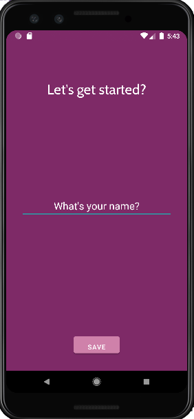
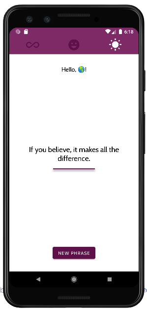

## Motivation APP

\
\
This app was created from a study in kotlin. Its purpose is to generate random motivational phrases.

### Language:

*   Kotlin 1.8.0 
*   Java 11.0.+

 

### Adroid API:
*    PIXEL 3 - API 27

    The choice of API 27 was based on the number of devices available to run the application.

---

 
 

### Language:
 

The application is available in 3 languages, English, Portuguese and French. The App checks the phone's language and automatically changes the app's language

---
 

### Opening Application

 

    To open and run the application, just access it in Android Studio using the 'file' and 'open' option, 
    then just access the folder where the project was saved.Gradle will automatically download the project's dependencies.
